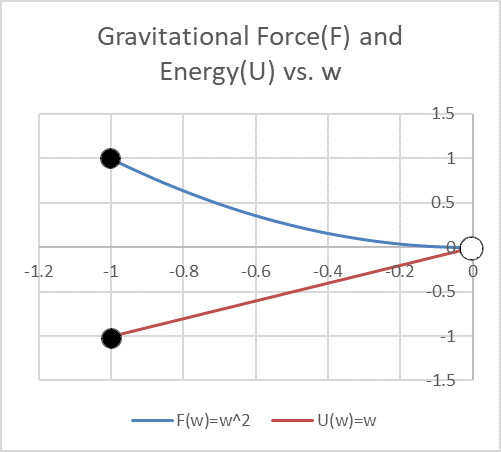
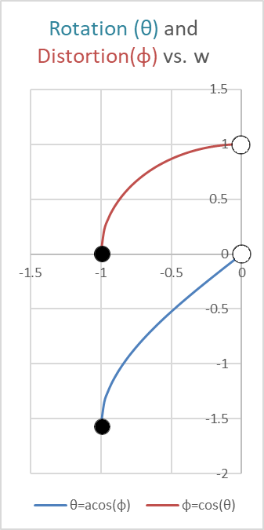
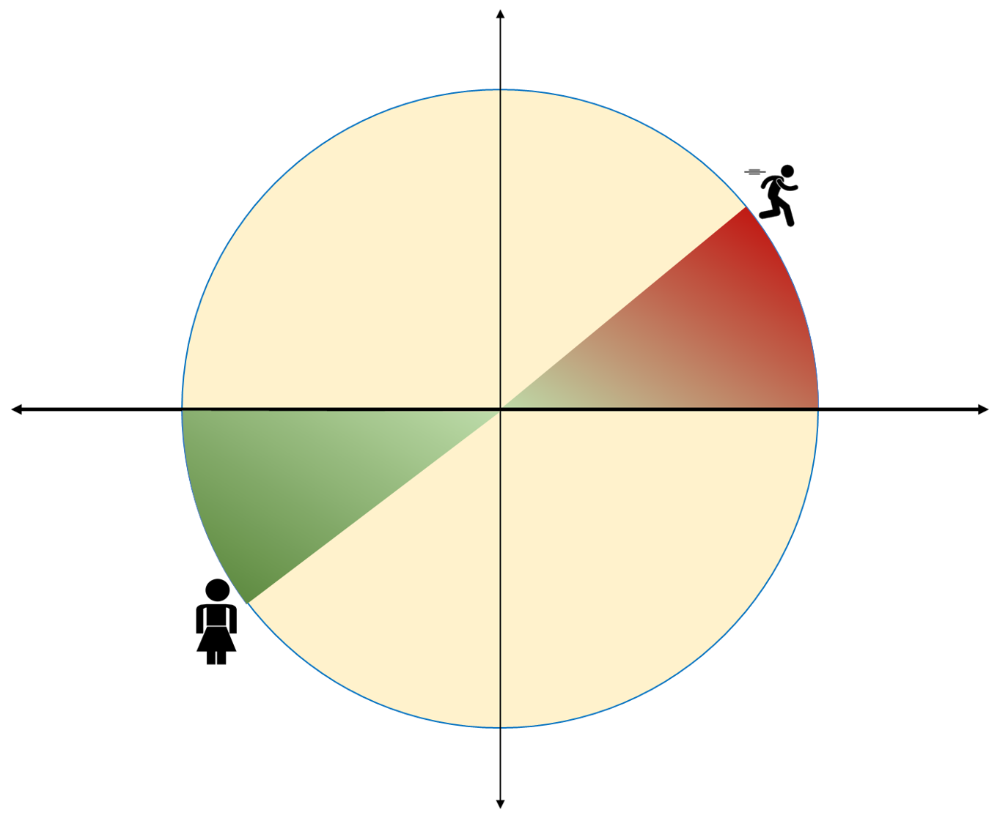

# An Alternate View of General Relativity

# Abstract

This work extends the Rotational Special Relativity (RSR) framework to gravitational systems, forming a unified Rotational General Relativity (RGR). The central proposal is that both kinetic and gravitational energy produce rotation into an additional q‑dimension, and that the observable relativistic effects—time dilation, length contraction, and reduced effective force—arise from this single geometric mechanism. By substituting gravitational potential energy into the RSR formalism and introducing a distortion coordinate w, the Schwarzschild field reduces to the same square‑root structure found in velocity‑based relativity. The result is a simplified, quadrant‑aware geometric model that reproduces Einsteinian predictions while offering a more intuitive pathway for teaching and interpretation.

## Background

Einsteinian general relativity.
[Rotational Special Relativity (RSR)](RSR.md)

## Introduction

Following tradition, this examination of general relativity is based in a thought experiment. As in Part 1, there is little new mathematics; the focus is on interpreting familiar equations into real‑world effects.

We take the final equation of Part 1 - RSR, in its Kinetic Energy form.

## Axiom

Next, we state an axiom - that 
 “Energy, whether kinetic or gravitational, induces rotation into the q dimension, producing consistent relativistic effects.

We will then prove the axiom to be consistent with Einsteinian GR results, but in a much simpler form suitable form more suitable for early training. 

Re-iterating the essentials of RSR :
 We consider the Traveller’s spaceship (*t*), now placed in a gravitational field generated by a massive body, and the Observer (*o*), who remains stationary at a safe distance.

The Traveller experiences local physics as Newtonian:

·     Proper acceleration feels constant,

·     Local measurements of length and time remain unchanged,

·     No “mass increase” is observed.

The Observer, however, perceives distortions:

·     Time appears dilated near the mass,

·     Lengths contract along the radial direction,

·     Forces appear less effective as the ship rotates into the *q* dimension.

Key

·     Subscript *o* means “as seen by the stationary observer.”

·     Subscript *t* means “as measured by the Traveller.”

·     The pseudo‑imaginary dimension *q* facilitates rotational displacement caused by high velocity.

# Step 1 — Dimensional reduction

We collapse the full four‑dimensional spacetime picture into a two‑dimensional cross‑section for clarity.

- **Horizontal axis (r·):**     radial distance from the mass, scaled relative to the event horizon radius.
- **Vertical axis (q):**     the pseudo‑imaginary axis into which spacetime is warped.
       This mirrors the RSR treatment, where velocity was plotted against q.
- For graphing purposes, we     use three-dimensional spherical symmetry to reduce the three-dimensional     model to one radial axis, and our imaginary Q axis.

# Step 2 - Recognition of the q axis

Here is a typical spatial distortion image, 
{#Fig:TypicalGravitationalDistortionOfSpace}

which works by 

·     reducing three-dimensional space to two dimensions.

·     Adding a third dimension into which space is distorted.

 

It is almost axiomatic that if space is warped, then it must be warped into another dimension. Otherwise, how can it be warped? You can’t warp a plane, without going outside the plane into three dimensions, so you can’t warp three-dimensions without a fourth dimension to warp “into”.

This dimension, which we name the q dimension is the vertical axis in the gravity well diagram. In part one of this paper, it was the dimension that the spaceship rotated into, to give its apparent length reduction.

A common misinterpretation of these diagrams is that we still need “gravity”, to cause a small mass to roll or slide down into the gravity well. A better interpretation would be that the curve represents a translation between radial distance and gravitational potential energy. And nature always tends towards the lowest energy state.
 Another way is to think that the gravity surface shown can only push on the mass m at right angles to the surface, and so always pushes mass towards the centre.

# Step 3 - Diagrammatic Simplification.

We can simplify the diagram via recognition of radial symmetry. All that we need is the shape along one radius through the field.

 Mathematics Simplification
 We use three main techniques:

·    Variable substitution   \( w\ =\ \frac{R_s}{r} \)                          

·   Conversion to natural units.   \( GM\ =\ 1 \)

·   Test mass \( m = 1kg => GMm = 1\)     

# Step 2 - Derivation

We start by applying our axiom, and converting RSR from dependence on kinetic energy ***k*** to gravitational potential energy.

 We start with the final equation from RSR
$$
cos\left(\theta\right)=\ \varphi=\ \sqrt{1-2k/m}
$$
And exchange gravitational potential energy *U* for kinetic energy *k.*

$$
cos\left(\theta\right)=\ \varphi=\ \sqrt{1-2U/m}
$$
At this point, we note that kinetic energy is always a positive value, whereas gravitational potential energy is negative, approaching zero at infinite distance. This shifts the area of interest for graphs from the top right quadrant, to the bottom left quadrant. This will have impacts on the sign of sine values, and hence tangent and slope.

Equation 2 was obtained by integrating the tangent of θ. Because gravitational potential energy  is negative, the corresponding depth into Q is negative, keeping θ positive (anticlockwise), and placing the vector in quadrant III of the unit circle. This mirrors the velocity rotation in quadrant I, and the two vectors are equal and opposite — cancelling each other to yield flat spacetime. Therefore equation 2 becomes 

$$
cos\left(\theta\right)=\ \varphi=\ \sqrt{1+2U/m}
$$

$$
F=\ -\frac{GMm}{r^2}
$$

Which integrates to 
$$
U\left(r\right)=C-\frac{GMm}{r}
$$
By tradition, U is zero at infinity, with closer distances corresponding to negative values of U. so the integration constant C = 0
$$
U\left(r\right)=-\frac{GMm}{r}
$$
We note at this time the concepts of black holes and Schwarzschild Radius  (the radius of the event horizon)

$$
R_{s\ }=\ \frac{2GM}{c^2}
$$
If c is in natural units, then c=1

$$
R_{s\ }=\ 2GM
$$

And further, we can replace r with a normalised value  
$$
r^\ast\ =\ \frac{r}{R_s}\ =\ r/2GM \\
r=\ 2GM{\ r}^\ast
$$
Substituting back into equations 4 and 5, we get
$$
F\left(r\right)=\frac{-GMm}{r^2}\Rightarrow U\left(r^\ast\right)=\frac{-m}{{2r}^\ast}
$$

   

## Quadrant Conventions

The horizontal axis is the positive radius r, measuring distance to the centre; the vertical axis shows gravitational quantities. In r‑space, gravitational potential energy is negative and the inward force is plotted as positive,
$$
F(r) = +1/r^2
$$

$$
U(r) = -1/r
$$
so contraction appears visually positive as the test mass moves inward.

For cosmogony distortions, we introduce the auxiliary coordinate
$$
w = -1/r^*
$$

a monotonic inverse‑radius variable chosen to keep gravitational quantities in the **lower‑left quadrant** of the unit circle. Although r∗>0, the negative sign places the gravitational branch opposite the kinetic branch (RSR), preserving the orthogonality of the two domains. Conceptually, gravity draws a test mass inward **from the left**, while the RSR spacecraft accelerates **to the right**; energy increases consistently from left to right in both cases.

Under this substitution, gravitational energy maps cleanly to
$$
U(w)=-\frac{mw}{2}
$$

so negative gravitational energy corresponds to negative w. The rotation angle in the RGR domain satisfies
$$
\cos\theta_g=φ=\sqrt{1+w}
$$
with \(w<0\) ensuring \(θ_g<0\). This contrasts with the velocity rotation in RSR, where \(θ_v>0\). The square‑root factor \(\varphi\) links geometric depth to tempo without sign conflicts, and the compactified coordinate w avoids the unpleasant limits of the raw r‑space expression (r∗→∞, U→−∞).

Substituting into 11 and 12
$$
\begin{align}
F(w) &= -w^2 \\
U(w) &= -\frac{mw}{2}
\end{align}
$$

 (mnemonic: w is chosen because it is the next letter after v, and v is the independent variable in RSR. We will find that using w gives function shapes identical to RSR)

# Calculation of \(\theta\) and \(\phi\)

 When we plug this version into eqn 3,

$$
cos\left(\theta\right)=\ \varphi=\ \sqrt{1\ -\ 2U/m}
$$
Becomes     

$$
cos\left(\theta\right)=\ \varphi=\ \sqrt{1\ +\ w}
$$

16. Since  \( U\ =\ -mw/2 \) , substitution yields    

$$
cos\theta\ =\ \sqrt{\left(1-\frac{2\left(\frac{-mw}{2}\right)}{m}\right)}
=\sqrt{\left(1+w\right)}
$$

###  **Rotation (\(\theta\)) and Distortion (\(\phi\)) vs. w**

 This diagram shows how gravitational potential (negative w) induces clockwise rotation into the q-dimension, yielding real, positive distortion factors   The symmetry with RSR is preserved, but the quadrant orientation is reversed. 

We can easily compare this with the equivalent formula for velocity from Part 1
$$
cos\left(\theta\right)=\ \varphi=\ \sqrt{1-v_o^2}
=> v_o^2\ \leftrightarrow w
$$

Except that in RSR, w is positive over the range [0,1), 
 and in RGR, w is negative over the range (-1,0]
 So both will give positive values for phi.

 

It is striking that the algebra reverts to the same square‑root form regardless of quadrant. The difference lies only in orientation: sine and cosine balance each other to preserve the unit circle, while the sign of q reflects whether the rotation is drawn upward or downward. Thus, the gravitational case mirrors the velocity case, with the same geometry but a different quadrant convention. There is no actual need to work through the detail. It will always be a subtraction within the square root.

Thus, gravitational rotation mirrors velocity rotation: both reduce to the same square‑root geometry, differing only in quadrant orientation. The algebra is invariant; only the sign of w or v determines whether rotation is drawn upward or downward in q.

# Quick derivation: Cancellation of Rotations

Start from the two distortion factors:

#### Velocity (RSR):

$$
\varphi=\cos{\left(\theta_v\right)}=\sqrt{1-v^2}, \theta_v>0
$$

#### Gravity (RGR):

$$
\varphi=\cos{\left(\theta_g\right)}=\sqrt{1+w}, w<0
$$

Both give the same positive   , but the angles have opposite signs.

#### Express in terms of rotation

Since cosine is even
$$
\cos{\left(\theta_v\right)}=\cos{\left(-\theta_v\right)}, \cos{\left(\theta_g\right)}=\cos{\left(-\theta_g\right)}
$$

So the observable distortion \(\varphi\) is insensitive to the sign of the angle.

#### Step 2 — Combine rotations

Define total rotation:
$$
\theta_{\mathrm{total}}=\theta_v+\theta_g  \\
With\ \ \theta_v>0  (counter clockwise) \\
and \ \theta_v<0 (clockwise) \\
\theta_v+\theta_g=0
$$
This is the **escape (velocity) condition**: kinetic rotation cancels gravitational rotation.

Step 3 — Interpret physically

- Distortion factors remain positive (+ve) on both sides.

- The sign of \theta encodes     orientation into the q-dimension.

- When the two rotations cancel, the traveller’s path returns to flat spacetime — no net rotation into q.

  

Displacements are plotted in the w–q plane, with horizontal axis w (energy-derived distortion) and vertical axis q (rotational displacement). Velocity rotation (Traveller) lies in the first quadrant with \(w>0\); gravitational rotation (Observer) lies in the third quadrant with \(w<0). The vectors from the origin to each point are equal and opposite, so their sum is zero. This geometric symmetry encodes the escape condition: when kinetic and gravitational distortions cancel, the traveller returns to flat spacetime.

Here we see the concept of phase difference between Traveller and Observer. With opposing phase angle, their energies are exactly out of phase, and so cancel. The result should be an inertial frame of reference, with no relativistic distortion.