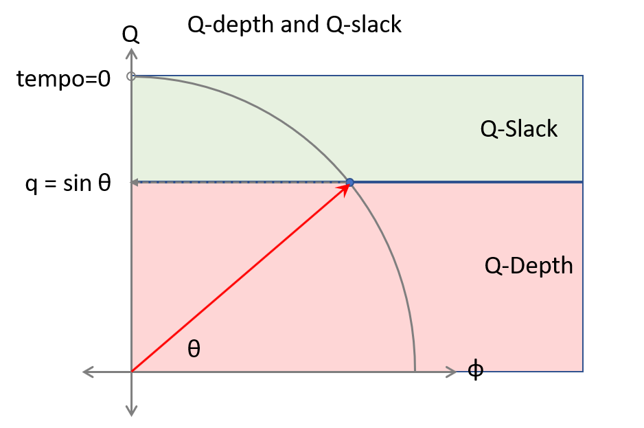
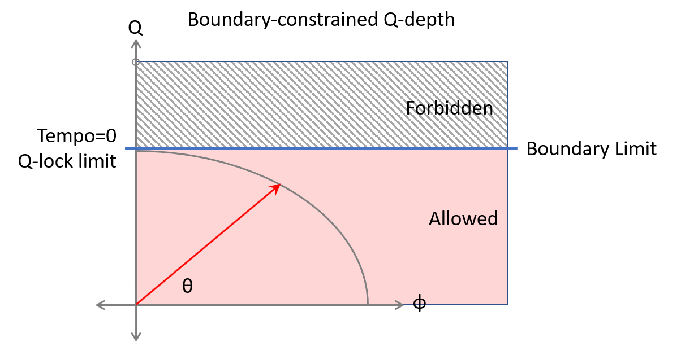
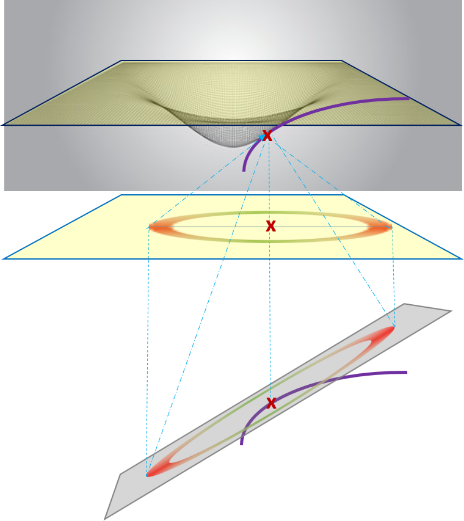
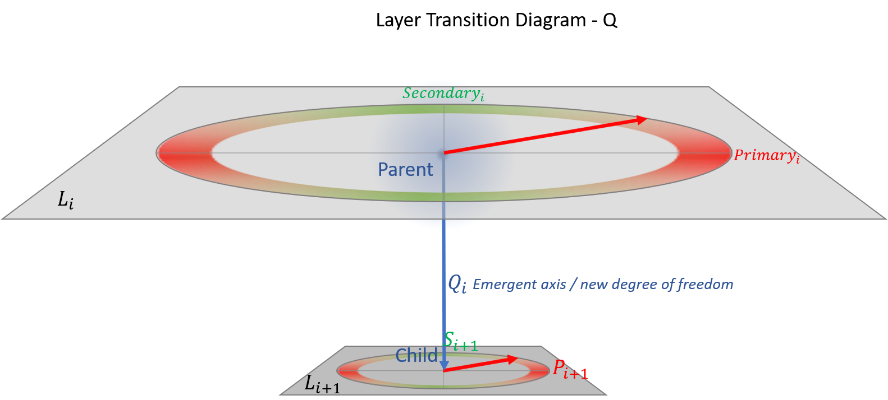
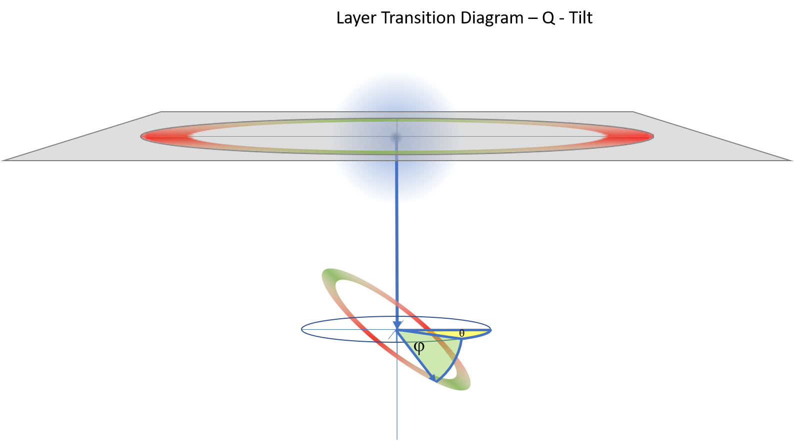

## Sample

<figure>
  
  <figcaption>*caption*</figcaption>
</figure>

# **1. Lorentz Circle (RSR Core Diagram)**

**Document:** RSR.md, HiddenQDimension.md, FormalFramework.md **Purpose:** Show rotation into Q as the geometric origin of SR effects.

### **Diagram Description**

A clean 2D unit circle in the **v–q plane**.

- **Horizontal axis:** v (real velocity axis), labelled from 0 to 1.
- **Vertical axis:** q (imaginary Q‑axis), labelled from 0 to 1.
- **Circle:** radius 1, centred at the origin.
- **State vector:** a radius from the origin to a point on the circle at angle θ.
- **Projection:**
  - Horizontal projection = \(ϕ=cos⁡θ\).
  - Vertical projection = \(q=sin⁡θ\).
- **Labels:**
  - “Observer sees: \(ϕ\) (length/Tempo projection)”
  - “Hidden rotation: \(q\)”
  - “Rotation angle: \(θ\)”

### **Caption**

<figure>
  
  <figcaption>*Rotation into the Q‑axis produces Lorentz contraction and time dilation. The distortion factor* \(ϕ=cos⁡θ\) *is the projection of the state vector onto the real axis.*</figcaption>
</figure>

# **2. SR Rotation Curve**

Special Relativity can be expressed as a **rotation of a unit State Vector** within the (ϕ,q) plane. This rotation does not describe motion through space. It describes how the *state of motion* changes as a system accelerates or decelerates.

The State Vector always has unit length,
$$
ϕ^2 +q^2=1
$$

so any change in motion must appear as a **rotation**, not a change in magnitude. The rotation angle is θ, defined by

ϕ=cos⁡θ, q=sin⁡θ.

## **2.1 Meaning of the Rotation Angle**

**θ is the angle of rotation away from normal space and toward alignment with the Q‑axis.**   The direction of the red State Vector uniquely determines:

- the system’s speed
- kinetic energy per unit mass
- rotation angle
- length‑reduction factor
- time‑dilation factor

A system at rest has \(θ=0\), lying entirely along the ϕ-axis. As the system accelerates, θ increases and the State Vector rotates upward toward the Q‑axis. Deceleration rotates it downward toward the horizontal.

Because the State Vector must remain unit length, its tip is constrained to move **along the circular arc**.

## **2.2 Tangent and Direction of Change**

When θ changes, the tip of the State Vector moves along the circle. The **tangent** at the current point shows the **instantaneous direction of this change**.

The tangent is not a spatial direction. It is the direction in which the *state* moves when the system accelerates or decelerates.

Acceleration rotates the State Vector **toward** the Q‑axis. Deceleration rotates it **away** from the Q‑axis.

The inward blue vector represents the physical cause of this rotation: it is the component of force that changes θ. The tangent shows the resulting motion of the State Vector along the arc.

## **2.3 Projections and Observables**

The projections of the State Vector give the observable quantities:

- \(ϕ=cos⁡θ\): the Tempo or contraction factor
- \(q=sin⁡θ\): the hidden rotational component

These two values fully specify the SR state.

## **2.4 The SR Limit**

As \(θ→90^∘\):

- \(ϕ→0\)
- \(q→1\)
- Tempo approaches zero
- velocity approaches the speed of light

This limit is marked with an **open circle**, indicating that it is an **unreachable asymptote**. No finite acceleration can rotate the State Vector all the way to \(ϕ=0\).

## **2.5 Role of the SR Rotation Curve**

This circular geometry is the **native form of SR**. It establishes the rotational structure that later sections reinterpret:

- RSR (kinetic reinterpretation)
- RGR (gravitational reinterpretation)
- RR (unified coordinate system)
- Phase Circle (abstracted symmetry form)

All of these later constructions grow from the geometry introduced here.

### **Caption**

***Figure 2 — SR Rotation Curve**

The SR State Vector (red) rotates within the unit circle as the system accelerates or decelerates. Its direction encodes the system’s speed, kinetic energy per unit mass, contraction factor, and time‑dilation factor. Acceleration increases the rotation angle θ, moving the State Vector upward toward the Q‑axis; deceleration reduces θ, rotating it back toward the spatial axis. Because the State Vector must remain unit length, its tip moves along the circular arc. The tangent (green) shows the instantaneous direction of this rotational change, while the inward vector (blue) represents the force component that changes θ. The projections give the observable components: ϕ=cos⁡θ (Tempo) and q=sin⁡θ. The open circle at ϕ=0 marks the SR limit where Tempo → 0, an unreachable asymptote.*

<figure>
  
  <figcaption>*Figure 2 — SR Rotation Curve
The SR State Vector (red) rotates within the unit circle as the system accelerates or decelerates.
Its direction encodes the system’s speed, kinetic energy per unit mass, contraction factor, and time‑dilation factor.
Acceleration increases the rotation angle θ, moving the State Vector upward toward the Q‑axis; deceleration reduces θ, rotating it back toward the spatial axis.
Because the State Vector must remain unit length, its tip moves along the circular arc.
The tangent (green) shows the instantaneous direction of this rotational change, while the inward vector (blue) represents the force component that changes θ.
The projections give the observable components:
𝜙
=
cos
⁡
𝜃
 (Tempo) and 
𝑞
=
sin
⁡
𝜃
.
The open circle at 
𝜙
=
0
 marks the SR limit where Tempo → 0, an unreachable asymptote.*</figcaption>
</figure>

# **3. P–S–Q Plane (Generic Layer Diagram)**

**Document:** LayeredSymmetry.md, DimensionalDerivation.md **Purpose:** Show the structure of each symmetry layer.

### **Diagram Description**

A 3‑axis diagram:

- **Horizontal axis:** Pi (primary axis).
- **Vertical axis:** Si (secondary axis).
- **Normal axis:** Qi, drawn perpendicular to the P–S plane.
- **Plane:** a shaded rectangle representing the P–S symmetry plane.
- **Rotation arrow:** a curved arrow showing rotation within the P–S plane.
- **Q‑lock indicator:** a boundary surface or horizon limiting motion along Qi.

### **Caption**

*Each symmetry layer is defined by a P–S plane and a normal Q‑axis. Symmetry lives in the plane; boundaries act along Q.*

<figure>
  
  <figcaption>Each symmetry layer is defined by a P–S plane and a normal Q‑axis. Symmetry lives in the plane; boundaries act along Q</figcaption>
</figure>

# **4. Q‑Lock Schematic**

**Document:** SymmetryLocks.md **Purpose:** Show how boundaries restrict Q‑axis freedom.
P is Primary energy mode.
S is secondary energy mode, which is \(dP/dQ\)
Q is the Q dimension, inherited from a parent layer.

### **Diagram Description**

A simplified version of the P–S–Q diagram with a boundary:

- **P–S plane:** drawn as a flat sheet.
- **Q axis:** vertical arrow emerging from the plane.
- **Boundary surface:** a horizontal “ceiling” above the plane, blocking upward Q‑motion.
- **State vector:** angled upward into Q but truncated by the boundary.
- **Allowed region:** shaded region below the boundary.
- **Forbidden region:** shaded region above the boundary.

### **Caption**

<figure>
  
  <figcaption>*The red band shows the portion of Q‑space already rotated into (used), while the green band shows the remaining slack (available). Their intersection at the state‑vector tip marks the point where further rotation becomes increasingly constrained, leading eventually to full Q‑lock.*</figcaption>
</figure>

<figure>
  
  <figcaption>*Figure Y: Boundary‑constrained Q‑depth.  
The red region shows the physically allowed Q‑depth, bounded above by the tempo = 0 line. The hatched grey region represents the forbidden zone beyond this boundary. The ellipse flattens asymptotically against the boundary, marking the limit where Q‑slack vanishes and Q‑lock begins.*</figcaption>
</figure>

<figure>
  
  <figcaption>*caption*</figcaption>
</figure>

# **5. Layer Transition Diagram (Lᵢ → Lᵢ₊₁)**

**Document:** LayerTransitions.md **Purpose:** Show how each new primary axis emerges.

### **Diagram Description**

Two stacked planes:

- **Lower plane:** Pᵢ–Sᵢ plane (Layer Lᵢ).
- **Upper plane:** Pᵢ₊₁–Sᵢ₊₁ plane (Layer Lᵢ₊₁).
- **New axis:** Pᵢ₊₁ drawn as a vertical axis emerging orthogonally from the lower plane.
- **Transition arrow:** curved arrow showing the “birth” of the new axis.
- **Labels:**
  - “New degree of freedom”
  - “Dimensional expansion”
  - “Layer transition: Lᵢ → Lᵢ₊₁”

### **Caption**
*A layer transition* Li→Li+1 *occurs when the generative field within the parent layer activates the emergent axis* Qi*, introducing a new degree of freedom. The child layer inherits its primary and secondary axes (*Pi+1,Si+1*) through this dimensional tension, representing a structured expansion of the system’s hierarchy.*

<figure>
  
  <figcaption>A layer transition Li→Li+1 occurs when the generative field within the parent layer activates the emergent axis Qi, introducing a new degree of freedom. The child layer inherits its primary and secondary axes Pi+1,Si+1 through this dimensional tension, representing a structured expansion of the system’s hierarchy.</figcaption>
</figure>

# **6. Q‑Tilt Diagram (Qₚ → Q𝚌)**

**Document:** LayerTransitions.md **Purpose:** Show how the child layer’s phase plane tilts relative to its parent, defining the emergent Q‑axis geometry.

### **Diagram Description**

Two phase planes within the embedding sphere:

- **Upper plane:** Parent OP‑plane (E₀–T₀) with normal **Qₚ**.
- **Lower tilted plane:** Child phase plane with normal **Q𝚌**, inclined by angle **θ**.
- **Azimuthal rotation:** **φ**, defining the orientation of the child plane around the parent’s Q‑axis.
- **Blue vertical line:** Shared Q‑axis reference linking parent and child domains.
- **Green wedge:** Composite rotation between **θ** and **φ**, representing the generative tilt.
- **Sphere:** Embedding domain of Q‑space curvature where the tilt occurs.

### **Caption**

*A Q‑tilt* (Qₚ→Q𝚌) *represents the angular displacement between parent and child phase planes. The tilt angles* (θ, φ) *encode the compound rotation that generates Q‑depth and phase‑orientation within the embedding sphere. This geometry defines how each layer inherits and re‑expresses its Q‑axis, establishing the dynamic linkage between generative potential and emergent dimensional structure.*

<figure>  <figcaption>A Q‑tilt (Qₚ→Q𝚌) represents the angular displacement between parent and child phase planes. The tilt angles (θ, φ) encode the compound rotation that generates Q‑depth and phase‑orientation within the embedding sphere. This geometry defines how each layer inherits and re‑expresses its Q‑axis, establishing the dynamic linkage between generative potential and emergent dimensional structure.</figcaption> </figure>

# **6. L₀ — Tempo Layer Diagram**

**Document:** Tempo.md, HiddenQDimension.md **Purpose:** Show Tempo as the projection of worldline orientation onto the real axis.

### **Diagram Description**

A 2D diagram showing a worldline tilted into Q:

- **Axes:**
  - Horizontal: “Real axis / Observable progression”
  - Vertical: “Q₀ axis / Phase normal”
- **Worldline:** a diagonal arrow pointing upward-right, representing the system’s actual motion through (real + Q).
- **Projection:**
  - Horizontal projection labelled **Tempo = cos θ**
  - Vertical projection labelled **Q‑depth = sin θ**
- **Angle θ:** between worldline and horizontal axis.
- **Labels:**
  - “At rest: θ = 0 → Tempo = 1”
  - “High energy: θ increases → Tempo decreases”
  - “Tempo is the projection of worldline onto the real axis.”

### **Caption**

*Tempo is the projection of a system’s worldline onto the real axis. Energy rotates the worldline into Q₀, reducing Tempo.*

<figure>
  
  <figcaption>*Tempo is the projection of a system’s worldline onto the real axis. Energy rotates the worldline into Q₀, reducing Tempo.*</figcaption>
</figure>

# **7. L₁ — Geometry Layer Diagram**

**Document:** LayeredSymmetry.md **Purpose:** Show spatial normals and geometric Q₁‑locks.

### **Diagram Description**

A simple geometric boundary diagram:

- **Plane:** horizontal P₁–S₁ plane representing geometric freedom.
- **Q₁ axis:** vertical arrow labelled “Spatial normal”.
- **Boundary:** a rigid wall or cavity drawn as a vertical barrier intersecting the plane.
- **Standing wave:** sinusoidal pattern between two boundaries.
- **Q‑lock indicator:** arrows showing that the boundary restricts motion along Q₁.

### **Caption**

*Geometric boundaries restrict spatial symmetry by locking the Q₁ axis. Standing waves and fixed endpoints are Q₁‑locks.*

<figure>
  
  <figcaption>*caption*</figcaption>
</figure>

# **8. L₂ — Electromagnetic Layer Diagram**

**Document:** LayeredSymmetry.md, Diffraction docs **Purpose:** Show EM boundary conditions as Q₂‑locks.

### **Diagram Description**

A conductor boundary with EM fields:

- **Conductor surface:** thick vertical line.
- **Electric field (E):** arrows perpendicular to the surface, forced to zero at the boundary.
- **Magnetic field (B):** arrows parallel to the surface.
- **Q₂ axis:** normal to the EM phase plane.
- **Gauge lock:** a “forbidden region” shading showing that the conductor fixes the gauge normal.

### **Caption**

*Conductive boundaries enforce Q₂‑locks by fixing the gauge normal. E and B reorganise to satisfy the boundary condition.*

<figure>
  
  <figcaption>*caption*</figcaption>
</figure>

# **9. L₃ — Mass/Curvature Layer Diagram**

**Document:** LayeredSymmetry.md, RGR.md, GravitationalWaves.md **Purpose:** Show curvature depth and gravitational Q₃‑locks.

### **Diagram Description**

A gravitational well diagram reinterpreted in Q‑geometry:

- **Horizontal axis:** radial coordinate r.
- **Vertical axis:** Q₃ (curvature depth).
- **Curvature well:** a smooth downward curve representing gravitational potential.
- **Horizon:** a horizontal line at the bottom labelled “Tempo → 0 (Q₃‑lock)”.
- **Worldline:** a path descending into the well.
- **Labels:**
  - “Curvature normal = Q₃”
  - “Gravitational well = Q₃‑depth”
  - “Horizon = Q₃‑lock”

### **Caption**

*Gravity is a spatial gradient of Q₃‑depth. Horizons act as Q₃‑locks, forcing Tempo toward zero.*

<figure>
  
  <figcaption>*caption*</figcaption>
</figure>

# **10. L₄ — Internal Symmetry Layer Diagram**

**Document:** LayeredSymmetry.md **Purpose:** Show representation normals and confinement.

### **Diagram Description**

A colour‑charge diagram:

- **Triangle or 3‑axis diagram:** representing SU(3) colour space.
- **Axes:** three 120°‑separated axes labelled “r”, “g”, “b”.
- **Q₄ axis:** drawn perpendicular to the colour plane.
- **Confinement boundary:** a spherical or circular boundary around the origin labelled “Q₄‑lock: colour confinement”.
- **Quark state:** a point inside the boundary.
- **Gluon exchange:** arrows showing motion within the plane but not out of it.

### **Caption**

<figure>
  
  <figcaption>*caption*</figcaption>
</figure>

# **11. L₅ — Meta‑Symmetry Layer Diagram**

**Document:** LayeredSymmetry.md **Purpose:** Show the emergence of the SUSY generator and the meta‑normal Q₅.

### **Diagram Description**

A clean, abstract diagram showing the final layer in the symmetry stack:

- **Lower plane:** the L₄ internal symmetry plane (SU(3)×SU(2)×U(1)), drawn as a hexagon or multi‑axis plane.
- **New axis:** a vertical axis emerging orthogonally from the L₄ plane, labelled **P₅ = SUSY generator** Q^.
- **New plane:** a faint plane perpendicular to P₅, representing the L₅ P₅–S₅ plane.
- **Q₅ axis:** a normal to the new plane, labelled **meta‑normal**.
- **Boundary:** a “broken symmetry” surface above the plane, labelled **SUSY breaking (Q₅‑lock)**.
- **Optional:** arrows showing fermion ↔ boson mixing along P₅.

### **Caption**

*The L₅ layer introduces the SUSY generator as a new primary axis. SUSY breaking acts as a Q₅‑lock, restricting motion along the meta‑normal.*

<figure>
  
  <figcaption>*caption*</figcaption>
</figure>

# **12. RSR Rotation Diagram (Velocity Rotation into Q)**

**Document:** RSR.md **Purpose:** Show how velocity produces rotation into the Q‑dimension.

### **Diagram Description**

A refinement of the Lorentz circle, emphasising velocity:

- **Axes:**
  - Horizontal: v/c
  - Vertical: q
- **State vector:** drawn at angle θ from the horizontal.
- **Projection:**
  - Horizontal projection labelled **φ = √(1 − v²)**
  - Vertical projection labelled **q = v**
- **Velocity arrow:** a horizontal arrow showing the observed velocity.
- **Rotation arrow:** a curved arrow showing rotation into Q as velocity increases.
- **Labels:**
  - “Velocity increases → rotation into Q increases”
  - “Observer sees contraction and time dilation as φ shrinks.”

### **Caption**

*In RSR, velocity is a rotation into the Q‑dimension. Lorentz contraction and time dilation are projections of this rotation.*

<figure>
  
  <figcaption>*In RSR, velocity is a rotation into the Q‑dimension. Lorentz contraction and time dilation are projections of this rotation.*</figcaption>
</figure>

# **13. RGR Rotation Diagram (Gravitational Rotation into Q)**

**Document:** RGR.md **Purpose:** Show how gravitational potential produces rotation into Q.

### **Diagram Description**

A mirror‑image of the RSR diagram, but in the gravitational quadrant:

- **Axes:**
  - Horizontal: w=−1/r\* (negative, increasing left→right)
  - Vertical: q
- **State vector:** drawn in the **upper‑left quadrant**, angle θg negative.
- **Projection:**
  - Horizontal projection labelled **φ = √(1 + w)**
  - Vertical projection labelled **q = √(−w)**
- **Rotation arrow:** curved arrow showing clockwise rotation into Q.
- **Labels:**
  - “Gravitational potential increases → rotation into Q increases”
  - “Quadrant flip relative to RSR.”

### **Caption**

*In RGR, gravitational potential rotates the state vector into Q in the opposite quadrant from velocity. The same square‑root geometry appears with reversed orientation.*

<figure>
  
  <figcaption>*caption*</figcaption>
</figure>

# **14. Escape Condition Diagram (RSR + RGR Cancellation)**

**Document:** RGR.md **Purpose:** Show how kinetic and gravitational rotations cancel.

### **Diagram Description**

A 2‑vector diagram:

- **Vector 1:** RSR rotation vector in the **upper‑right quadrant**.
- **Vector 2:** RGR rotation vector in the **upper‑left quadrant**, equal magnitude, opposite direction.
- **Sum:** a resultant vector at the origin (zero).
- **Axes:**
  - Horizontal: distortion coordinate (v² ↔ w)
  - Vertical: Q displacement
- **Labels:**
  - “Escape condition: θv + θg = 0”
  - “Flat spacetime when rotations cancel.”

### **Caption**

*Escape velocity occurs when the RSR and RGR rotations cancel exactly. Their vectors lie in opposite quadrants but share the same square‑root geometry.*

<figure>
  
  <figcaption>*caption*</figcaption>
</figure>

# **15. Photon Ribbon Diagram (Spiral Photon Model)**

**Document:** Diffraction docs, Photon sections **Purpose:** Show the photon as a spiralling ribbon in Q‑Depth.

### **Diagram Description**

A 3D helical ribbon:

- **Helix:** a spiral advancing along the z‑axis (propagation direction).
- **Ribbon width:** a flat strip, not a cylinder.
- **Internal rotation:** arrows showing the ribbon twisting around its axis.
- **Projection:**
  - Side view: sinusoidal E‑field
  - Top view: sinusoidal B‑field
- **Q‑axis:** a vertical axis showing the internal rotation angle.
- **Labels:**
  - “Internal rotation = frequency”
  - “Projection = wave behaviour”
  - “Ribbon geometry stores phase and direction.”

### **Caption**

*A photon is a spiralling ribbon whose internal rotation projects as sinusoidal electric and magnetic fields. The ribbon geometry encodes phase, frequency, and direction.*

<figure>
  
  <figcaption>*caption*</figcaption>
</figure>

# **16. Diffraction Diagram 1 — Boundary Suppression**

**Document:** DiffractionAsBoundary‑DrivenRotation.md **Purpose:** Show how a conductive boundary suppresses the EM field near the slit walls.

### **Diagram Description**

A cross‑section of a slit:

- **Two vertical walls** representing the slit boundaries.
- **Electric field amplitude profile** across the slit:
  - Highest at the centre
  - Forced to zero at the walls
  - Drawn as a bowed curve (like a stretched membrane pinned at both ends).
- **Labels:**
  - “Conductive wall forces E → 0”
  - “Amplitude suppression near boundary”
  - “Boundary condition: tangential E = 0”

### **Caption**

*Conductive boundaries suppress the electric field near the walls, producing a bowed amplitude profile. This is the first geometric distortion imposed by the slit.*

<figure>
  
  <figcaption>*caption*</figcaption>
</figure>

# **17. Diffraction Diagram 2 — Phase Retardation**

**Document:** GeometricConditioningAndRelease-TheOriginOfDiffraction.md **Purpose:** Show how amplitude suppression retimes the oscillation cycle.

### **Diagram Description**

A phase profile across the slit:

- **Horizontal axis:** transverse coordinate y.
- **Vertical axis:** phase φ(y).
- **Curve:** bowed downward near the walls, flat in the centre.
- **Markers:**
  - “Centre: phase advanced”
  - “Near wall: phase delayed”
- **Optional:** small metronome icons showing slower oscillation near the walls.

### **Caption**

*Amplitude suppression slows the oscillation near the walls, producing a bowed phase profile. Phase lag is the geometric signature of boundary conditioning.*

<figure>
  
  <figcaption>*caption*</figcaption>
</figure>

# **18. Diffraction Diagram 3 — Phase Slope → Transverse Momentum**

**Document:** Both diffraction docs **Purpose:** Show how a tilted phase profile produces sideways momentum.

### **Diagram Description**

A two‑panel diagram:

**Left panel: Phase slope**

- Linear phase gradient across the slit.
- φ(y) drawn as a straight line with slope.
- Label: “Phase slope = ∂φ/∂y”.

**Right panel: Momentum**

- A wavefront leaving the slit at an angle.
- Poynting vector arrow tilted by angle θ.
- Label: “p_y = ħ k_y = ħ ∂φ/∂y”.

### **Caption**

*A phase slope across the aperture produces a sideways component of momentum. The photon leaves the slit already angled.*

<figure>
  
  <figcaption>*caption*</figcaption>
</figure>

# **19. Diffraction Diagram 4 — Full Boundary → Phase → Momentum Chain**

**Document:** DiffractionAsBoundary‑DrivenRotation.md **Purpose:** Show the entire mechanism in one unified diagram.

### **Diagram Description**

A left‑to‑right causal chain:

1. **Boundary suppression**
   - Field amplitude clipped near walls.
2. **Phase retardation**
   - Bowed phase profile.
3. **Phase slope**
   - Linear gradient across aperture.
4. **Ribbon shear**
   - Photon ribbon twisted sideways.
5. **Poynting vector tilt**
   - Energy flow angled.
6. **Sinc momentum distribution**
   - Central lobe + side lobes.

Each step is a small icon or mini‑diagram with arrows linking them.

### **Caption**

*Diffraction is a single geometric process: boundary suppression → phase distortion → phase slope → ribbon shear → momentum redistribution → sinc envelope.*

<figure>
  
  <figcaption>*caption*</figcaption>
</figure>

# **20. Gravitational Wave Diagram — Two‑Focus Geometry**

**Document:** GravitationalWaves.md **Purpose:** Show KE–GPE rotation using an ellipse with two foci.

### **Diagram Description**

A clean ellipse:

- **Left focus:** labelled “GPE focus (mass/curvature)”.
- **Right focus:** labelled “KE focus (mass‑free kinetic field)”.
- **Energy packet:** a point on the ellipse moving around it.
- **Arrows:** showing rotation of energy between the two foci.
- **Q₃ axis:** drawn perpendicular to the ellipse plane, indicating curvature depth.
- **Labels:**
  - “Energy oscillates between GPE and KE”
  - “Propagation = rotation between foci”
  - “Mass‑free KE focus explains energy transport without matter”

### **Caption**

*A gravitational wave is a rotation of energy between two foci: one containing curvature (GPE) and one containing a mass‑free kinetic structure (KE). This is the gravitational analogue of the E–B rotation in electromagnetism.*

<figure>
  
  <figcaption>*caption*</figcaption>
</figure>

# **21. Property Manifold Diagram (Generic 6‑Step Hierarchy)**

**Document:** TheSolution.md **Purpose:** Show the universal structure shared by all property manifolds.

### **Diagram Description**

A clean, left‑to‑right vertical stack of six boxes, each representing one step in the manifold hierarchy:

1. **Driving Property**
   - Box at the top.
   - Label: “Driving property (Layer parameter)”.
2. **Primary Force** F1
   - Arrow downward.
   - Box labelled “F1=−dE1/dx”.
3. **Primary Potential** E1
   - Box labelled “E1=−∫F1dx”.
4. **Primary Field Measure** A1
   - Box labelled “A1=dE1/dQparent”.
5. **Secondary Force** F2
   - Box labelled “F2=dF1/dQparent”.
6. **Secondary Energy** E2
   - Box labelled “E2=∫F2dx”.

Arrows connect each step, forming a clear causal chain.

### **Caption**

*Every property manifold follows the same six‑step hierarchy: driving property → primary force → primary potential → primary field measure → secondary force → secondary energy.*

<figure>
  
  <figcaption>*caption*</figcaption>
</figure>

# **22. Q_parent → Q_child Inheritance Diagram**

**Document:** TheSolution.md **Purpose:** Show how each manifold inherits one Q‑axis and generates the next.

### **Diagram Description**

Two stacked manifolds:

- **Upper manifold:** labelled “Parent manifold”.
  - A vertical arrow pointing downward labelled **Q_parent**.
- **Lower manifold:** labelled “Child manifold”.
  - A vertical arrow pointing downward labelled **Q_child**.

Between them:

- A curved arrow showing inheritance: **Q_parent (from above) → used for secondary expressions in this manifold → generates Q_child (for the next manifold)**.

### **Caption**

*Each manifold inherits a Q‑axis from the layer above and generates a new Q‑axis for the layer below. This creates the backbone of the OP‑stack.*

<figure>
  
  <figcaption>*caption*</figcaption>
</figure>

# **23. OP‑Stack Tree Diagram**

**Document:** TheSolution.md **Purpose:** Show the full hierarchical structure of manifolds and their Q‑axes.

### **Diagram Description**

A vertical tree diagram with seven layers:

1. **Geometric manifold**
   - Q_child = Tempo axis
2. **Energy–Tempo manifold**
   - Q_child = Mass‑tilt axis
3. **Mass manifold**
   - Q_child = Momentum axis
4. **Momentum manifold**
   - Q_child = EM propagation axis
5. **Electromagnetic manifold**
   - Q_child = Spin axis
6. **Spin manifold**
   - Q_child = Phase axis
7. **Phase manifold**
   - (terminal)

Each node has:

- A box with the manifold name
- A downward arrow labelled with the Q_child axis
- A note showing the driving property (e.g., mass, charge, spin)

### **Caption**

*The OP‑stack is a chain of manifolds, each inheriting a Q‑axis from the one above and generating a new Q‑axis for the one below. This structure unifies geometry, energy, mass, momentum, electromagnetism, spin, and phase.*

<figure>
  
  <figcaption>*caption*</figcaption>
</figure>

# **24. Scalar → Vector Lift Diagram**

**Document:** TheSolution.md **Purpose:** Show how adding Q_parent increases dimensionality.

### **Diagram Description**

A two‑panel diagram:

**Left panel: Scalar property**

- A single axis labelled “X”.
- A point on the axis labelled “Value of X”.

**Right panel: Vector expression**

- A 2D plane with axes:
  - Horizontal: X
  - Vertical: dX/dQparent
- The same point now becomes a vector: **(X, dX/dQ_parent)**.

An arrow labelled “Add Q_parent → dimensional lift”.

### **Caption**

*Introducing the inherited axis Q_parent lifts a scalar property into a 2‑component vector (X, dX/dQ_parent). This is the mechanism behind primary/secondary expressions.*

<figure>
  
  <figcaption>*caption*</figcaption>
</figure>

# **25. Tempo Curve Diagram (Cosmology)**

**Document:** README.md, Tempo.md **Purpose:** Show how Tempo decreases with Q‑depth.

### **Diagram Description**

A smooth curve:

- **Horizontal axis:** Q (cosmic depth).
- **Vertical axis:** Tempo T(Q).
- **Curve:**
  - Starts at T = 1 when Q = 0
  - Falls smoothly
  - Asymptotically approaches T = 0 as Q → ∞
- **Equation:**   T(Q)=11+(kQ)2   shown unobtrusively near the curve.
- **Markers:**
  - “Early universe: Tempo ≈ 1”
  - “Late universe: Tempo → 0 (freezeout)”

### **Caption**

*Tempo decreases smoothly with Q‑depth, approaching zero only asymptotically. This is the cosmological analogue of the SR velocity asymptote.*

<figure>
  
  <figcaption>*caption*</figcaption>
</figure>

# **26. Infinite Subjective Time Diagram**

**Document:** README.md **Purpose:** Show that ∫ T(Q) dQ diverges even though Tempo → 0.

### **Diagram Description**

A two‑panel figure:

### **Left Panel — Tempo Curve**

- Horizontal axis: Q (cosmic depth).
- Vertical axis: Tempo T(Q).
- Curve:
  - Starts at T = 1 at Q = 0
  - Falls smoothly
  - Approaches T = 0 asymptotically
- A shaded region under the curve from Q = 0 to Q = Q₁.
- A second shaded region from Q₁ to Q₂.
- A third shaded region from Q₂ to Q → ∞, labelled “Area finite per slice, infinite in total”.

### **Right Panel — Integral Divergence**

- Vertical axis: subjective time τ(Q).
- Horizontal axis: Q.
- Curve:
  - Starts at τ = 0
  - Rises steadily
  - Grows without bound as Q → ∞
- Label: “τ(Q) = (1/k) sinh⁻¹(kQ) → ∞”.

### **Caption**

*Tempo approaches zero asymptotically, but the integral of Tempo diverges. The universe can freeze physically while containing infinite subjective time.*

<figure>
  
  <figcaption>*caption*</figcaption>
</figure>

# **27. Redshift as Tempo Mismatch Diagram**

**Document:** Redshift.md, Tempo.md **Purpose:** Show gravitational redshift as a comparison of emitter and receiver Tempo.

### **Diagram Description**

A vertical gravitational well diagram:

- **Left side:**
  - A clock deep in the well.
  - Label: “Emitter Tempo = Tₑ (slower)”.
- **Right side:**
  - A clock higher up.
  - Label: “Receiver Tempo = Tᵣ (faster)”.
- **Photon path:**
  - A wavy arrow moving upward.
  - Frequency markers (wave crests) drawn closer together at the bottom and farther apart at the top.
- **Equation:**   νobs=νemit⋅TrTe

### **Caption**

*A photon climbing out of a gravitational well appears redshifted because the receiver’s Tempo is faster than the emitter’s. Redshift is a Tempo mismatch, not a stretching of the photon.*

<figure>
  
  <figcaption>*caption*</figcaption>
</figure>

# **28. Orbital Helix in (x, Q) Diagram**

**Document:** Tempo.md **Purpose:** Show orbits as helical paths in the (space, Q) geometry.

### **Diagram Description**

A 3D diagram:

- **Horizontal plane:** x–y space (ordinary orbital plane).
- **Vertical axis:** Q (curvature depth / Tempo axis).
- **Helical path:**
  - A spiral descending slightly into Q as it orbits.
  - The helix does not close perfectly — slight precession.
- **Labels:**
  - “Tangential motion keeps the object from reaching the horizon.”
  - “Q‑gradient produces curvature of the orbit.”
  - “Precession = mismatch between Newtonian and true Q‑geometry monorail.”

### **Caption**

*An orbit is a helical path in (x, Q). The object follows the path of maximal Tempo, which appears curved when projected onto space alone.*

<figure>
  
  <figcaption>*caption*</figcaption>
</figure>

# **29. Horizon as Tempo Zero Diagram**

**Document:** Tempo.md, RGR.md **Purpose:** Show how a horizon corresponds to Tempo → 0.

### **Diagram Description**

A vertical Tempo diagram:

- **Horizontal axis:** radial coordinate r.
- **Vertical axis:** Tempo T(r).
- **Curve:**
  - Starts at T = 1 far from the mass
  - Falls steadily
  - Approaches T = 0 at the horizon
- **Horizon line:**
  - A vertical dashed line at r = Rₛ
  - Label: “Event horizon: T = 0 (projection vanishes)”.
- **Worldline:**
  - A diagonal arrow approaching the horizon
  - From the outside: arrow flattens (projection → 0)
  - From the inside: arrow continues normally (internal Tempo unchanged)

### **Caption**

*A horizon is the place where the projection of Tempo onto the external rest axis becomes zero. Internally, Tempo remains normal; externally, the object appears frozen.*

<figure>
  
  <figcaption>*caption*</figcaption>
</figure>

# **30. Full Cosmology Diagram — Q‑Depth, Tempo, and Expansion**

**Document:** README.md, Tempo.md **Purpose:** Show the entire cosmological picture in one diagram.

### **Diagram Description**

A three‑layer composite diagram:

### **Top Panel — Q‑Depth Over Time**

- Horizontal axis: cosmic time T.
- Vertical axis: Q(T).
- Curve: rising steadily.

### **Middle Panel — Tempo vs Q**

- Horizontal axis: Q.
- Vertical axis: Tempo T(Q).
- Curve: falling asymptotically.

### **Bottom Panel — Expansion Rate**

- Horizontal axis: cosmic time T.
- Vertical axis: expansion rate H(T).
- Curve:
  - High early
  - Falls
  - Approaches a freezeout plateau
- Label: “Expansion slows as Tempo falls”.

### **Caption**

*Cosmic evolution is a rise in Q‑depth, a fall in Tempo, and a corresponding slowdown in expansion. The universe approaches freezeout asymptotically, never reaching it in finite subjective time.*

<figure>
  
  <figcaption>*caption*</figcaption>
</figure>
